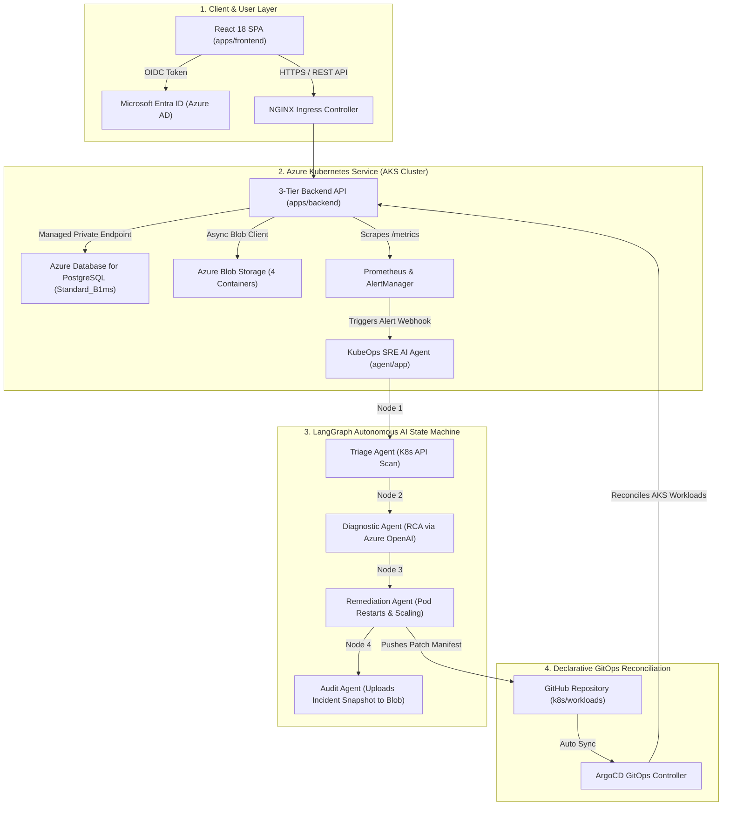

# ⚡ KubeOps-Aegis (Azure): Autonomous Self-Healing Kubernetes & GitOps Agent

[](https://python.org)
[](https://langchain-ai.github.io/langgraph/)
[](https://azure.microsoft.com)
[](https://reactjs.org)
[](https://argoproj.github.io/argo-cd/)
[](https://terraform.io)

**KubeOps-Aegis (Azure Edition)** is a multi-disciplinary **Autonomous SRE AI Agent & 3-Tier Enterprise E-Commerce Platform** engineered for **Azure Kubernetes Service (AKS 1.30+)** with **Microsoft Entra ID (OIDC)** authentication, **Azure Managed PostgreSQL**, **Azure Blob Storage**, and **ArgoCD GitOps** self-healing.

---

## 🏛️ End-to-End Architecture & Operational Flow



---

## 🗄️ Azure Storage Containers & Database Cost Optimization

### 📦 Azure Blob Storage Containers (Single Storage Account: `kubeopsaegisstprd`)
Instead of managing multiple storage buckets, all object data is organized inside **4 dedicated Azure Storage Containers**:

1. `tfstate`: Remote state backend for Terraform deployment locking.
2. `incident-logs`: Stores SRE AI Agent incident audit JSON snapshots.
3. `user-media`: Product catalog images and user profile avatars.
4. `order-receipts`: Customer PDF order checkout receipts.

### 💰 Cost-Optimized Azure Managed PostgreSQL Database
* **SKU**: `Standard_B1ms` (Burstable 1 vCPU, 2 GiB RAM, 32 GB Storage).
* **Cost**: Only **~$15.00 – $25.00 / month** (~$0.50/day).
* **Delegated Subnet**: Runs inside `snet-database` (`10.100.3.0/24`) with Zero Public Network Access.

### 🔮 Neo4j Graph Database Options
* **Option A (Neo4j AuraDB Managed Cloud)**: Recommended! Uses Neo4j's official managed service on Azure with a **Free Tier ($0/month)**.
* **Option B (Self-Hosted Azure VM)**: Provided in Terraform module `modules/neo4j` for specialized private VM deployments.

---

## 🔒 Azure Security & Isolation Rules

1. **Subnet Security Groups (NSGs)**:
   * `snet-aks-system` & `snet-aks-user`: Egress routed through **Azure Standard NAT Gateway**.
   * `snet-database`: Accepts PostgreSQL traffic (5432) strictly from AKS subnets.
   * `snet-private-endpoints`: Restricts Key Vault & Storage access to VNet.
2. **Azure Workload Identity**: Passwordless authentication binding Kubernetes ServiceAccount `default:aegis-agent-sa` to Azure User-Assigned Managed Identity via OIDC federated credentials.
3. **Microsoft Entra ID (OIDC)**: Validates incoming Bearer JWT tokens against Azure AD JWKS endpoint.

---

## 🛠️ API Endpoint Directory

### 🔑 Authentication (`/api/v1/auth`)
* `POST /api/v1/auth/register`: Register new customer profile.
* `POST /api/v1/auth/login`: Authenticate and return Bearer JWT token.

### 📦 Product Catalog (`/api/v1/products`)
* `GET /api/v1/products`: List catalog products (supports `?category=` filter & `?search=`).
* `GET /api/v1/products/{id}`: Detailed product metadata.

### 🛒 Checkout & Orders (`/api/v1/orders`)
* `POST /api/v1/orders`: Create new order & trigger PDF receipt upload.
* `GET /api/v1/orders`: List order history.

### 📄 Azure Blob Uploads (`/api/v1/uploads`)
* `POST /api/v1/uploads/receipt`: Upload PDF payment receipt to `order-receipts` container.

### 💥 SRE Chaos Simulations (`/api/v1/chaos`)
* `GET /api/v1/chaos/db-query-timeout`: Simulates PostgreSQL 15s lock wait deadlock (`504 Gateway Timeout`).
* `GET /api/v1/chaos/http-request-timeout`: Simulates payment gateway read timeout (`504 Gateway Timeout`).
* `POST /api/v1/chaos/oom-leak`: Allocates 150MB buffer chunks to trigger `OOMKilled`.
* `POST /api/v1/chaos/cpu-burn`: Heavy CPU prime calculations to trigger HPA scaling.

---

## 🚀 Step-by-Step Deployment Roadmap

```bash
# 1. Log in to Azure CLI
az login

# 2. Deploy Azure Infrastructure (Phase 1: VNet & NAT, Phase 2: Data Layer, Phase 3: AKS)
cd terraform
terraform init
terraform apply -var-file="env/prd.tfvars" -auto-approve

# 3. Connect kubectl to AKS Cluster
$(terraform output -raw kubeconfig_command)

# 4. Deploy 3-Tier Application & SRE Agent
kubectl apply -f ../k8s/3tier-app/
kubectl apply -f ../k8s/agent/
kubectl apply -f ../k8s/argocd/
```
