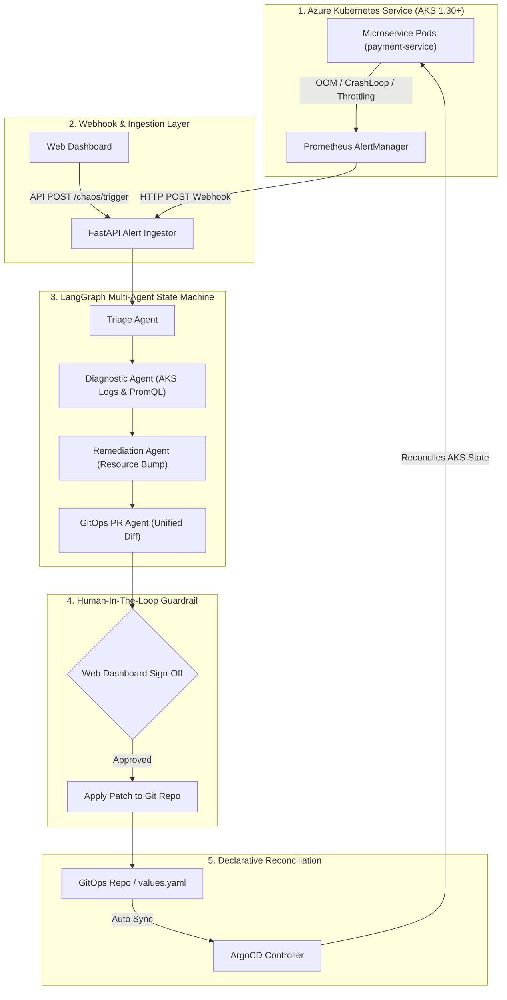

# ⚡ KubeOps-Aegis (Azure): Autonomous Self-Healing Kubernetes & GitOps Agent

[](https://python.org)
[](https://langchain-ai.github.io/langgraph/)
[](https://azure.microsoft.com)
[](https://argoproj.github.io/argo-cd/)
[](https://terraform.io)
[](https://prometheus.io)

**KubeOps-Aegis (Azure Edition)** is an enterprise-grade **Autonomous SRE & GitOps AI Agent** engineered for production **Azure Kubernetes Service (AKS 1.30+)** environments.

---

## 🏛️ Azure Architecture & Flow



---

## 🔒 Azure Security Protocols & Networking Highlights

1. **Dedicated Subnet Isolation**: AKS system and user node pools run in isolated private subnets (`10.100.1.0/24` and `10.100.2.0/24`).
2. **Azure NAT Gateway**: Outbound egress is routed through an **Azure Standard NAT Gateway** with static Public IP.
3. **Network Security Group (NSG)**: Enforces strict inbound rules (`AllowHTTPSInbound`, `AllowVNetInbound`, `DenyAllInbound`).
4. **Azure Workload Identity**: Uses federated OIDC credentials mapping Kubernetes ServiceAccount (`default:kubeops-agent-sa`) to Azure Managed Identity.
5. **Azure Container Registry (ACR)**: Configured with `AcrPull` role binding to AKS Kubelet Managed Identity.

---

## 📂 Repository Structure

```
KubeOps-Aegis/
├── agent/                         # Python AI Agent (LangGraph + FastAPI + K8s API)
│   ├── app/
│   │   ├── agents/                # Triage, Diagnostic, Remediation, GitOps, PostMortem agents
│   │   ├── api/                   # FastAPI routes & WebSocket manager
│   │   ├── core/                  # Settings (Azure/AWS), state schemas, LLM factory
│   │   ├── graph/                 # LangGraph State Machine compilation
│   │   ├── tools/                 # AKS / EKS K8s tools, Prometheus PromQL, Git tools
│   │   └── main.py                # Agent daemon entrypoint
│   ├── tests/                     # Pytest suite
│   └── requirements.txt
├── web/                           # Real-Time Glassmorphism SRE Dashboard
├── k8s/                           # PrometheusRules, AlertManager config, Chaos tools
├── gitops/                        # GitOps Application Helm chart & ArgoCD CRDs
├── terraform/                     # Production Azure AKS Infrastructure (RG, VNet, NAT, NSG, AKS, ACR)
│   ├── main.tf                    # Resource Group, VNet, Subnets, NAT Gateway, NSG
│   ├── aks.tf                     # AKS 1.30+ CNI Overlay cluster & Node Pools
│   ├── identity.tf                # Azure Workload Identity & Federated Credentials
│   ├── acr.tf                     # Azure Container Registry & AcrPull RBAC
│   ├── argocd.tf                  # ArgoCD Helm deployment
│   ├── prometheus.tf              # Prometheus Stack Helm deployment
│   └── env/prd.tfvars             # Production Azure tfvars
├── scripts/                       # Run & Demo Scripts
│   ├── run_agent.ps1              # Agent daemon launcher
│   └── simulate_incident.py       # Interactive CLI simulator
└── README.md
```

---

## 🚀 Azure AKS Deployment Guide

```bash
# 1. Log in to Azure CLI
az login

# 2. Deploy Azure Infrastructure via Terraform
cd terraform
terraform init
terraform apply -var-file="env/prd.tfvars" -auto-approve

# 3. Connect kubectl to AKS
$(terraform output -raw kubeconfig_command)

# 4. Run the Agent Backend
cd ../agent
pip install -r requirements.txt
python -m agent.app.main
```
