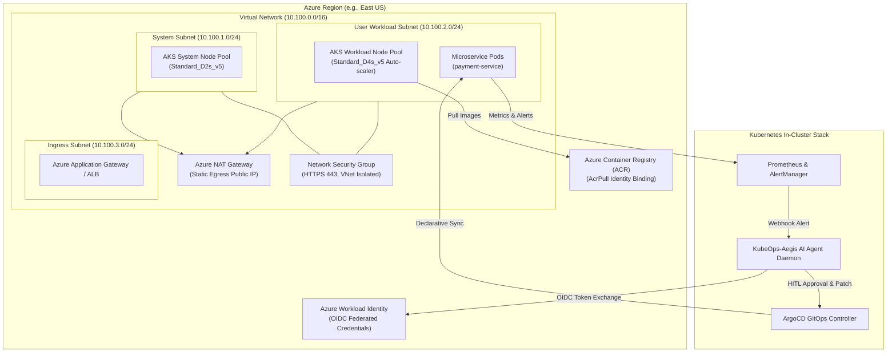

# ⚡ KubeOps-Aegis: Azure Enterprise Architecture & Deployment Guide

Welcome to the **Microsoft Azure Architecture** of **KubeOps-Aegis (Autonomous Self-Healing Kubernetes & GitOps AI Agent)**.

This implementation rebuilds the complete Cloud-Native AI-Ops infrastructure on **Microsoft Azure** using **Azure Kubernetes Service (AKS 1.30+)**, **Azure VNet + Subnets + NAT Gateway**, **Network Security Groups (NSGs)**, **Azure Workload Identity (OIDC)**, **Azure Container Registry (ACR)**, **ArgoCD**, and the **Prometheus Stack**.

---

## 🏛️ 1. Azure System Architecture



---

## 🔒 2. Security Protocols & Networking Safeguards

1. **Private Subnet Isolation**: AKS nodes sit inside dedicated private subnets (`10.100.1.0/24` and `10.100.2.0/24`). No direct public IP addresses are assigned to worker nodes.
2. **Azure NAT Gateway Egress**: Outbound internet traffic for package updates and telemetry is routed through an **Azure Standard NAT Gateway** with a static public IP (`azurerm_public_ip`).
3. **Network Security Group (NSG)**: Enforces strict inbound rules (`AllowHTTPSInbound`, `AllowVNetInbound`, and an explicit `DenyAllInbound` catch-all rule).
4. **Azure CNI Overlay with Cilium**: High-performance eBPF container networking with pod IP allocation from an overlay network space.
5. **Azure Workload Identity (OIDC)**: Eliminates hardcoded Azure service principal secrets by mapping the Kubernetes Service Account (`default:kubeops-agent-sa`) directly to an **Azure User Assigned Managed Identity** via federated OIDC credentials.
6. **ACR Pull Security**: Uses Azure RBAC (`AcrPull` role) to grant AKS Kubelet identity access to pull private container images securely.

---

## 📂 3. Directory Structure

```
azure/
├── terraform/
│   ├── main.tf             # Resource Group, VNet, Subnets, NAT Gateway, NSG rules
│   ├── aks.tf              # AKS 1.30+ Cluster, Node Pools, Azure CNI, Providers
│   ├── identity.tf         # Azure Workload Identity & Federated OIDC credentials
│   ├── acr.tf              # Azure Container Registry (ACR) & AcrPull RBAC
│   ├── argocd.tf           # ArgoCD Helm deployment on AKS
│   ├── prometheus.tf       # Kube-Prometheus-Stack Helm deployment on AKS
│   ├── variables.tf        # Input variables
│   ├── outputs.tf          # Kubeconfig command & resource outputs
│   └── env/
│       └── prd.tfvars      # Production Azure environment variables
└── README_AZURE.md         # Architecture & Deployment Guide
```

---

## 🚀 4. Step-by-Step Deployment Instructions

### Prerequisites
1. **Azure CLI**: Install `az` CLI and log in:
   ```bash
   az login
   az account set --subscription "YOUR_AZURE_SUBSCRIPTION_ID"
   ```
2. **Terraform**: Ensure Terraform `v1.9+` is installed.
3. **Kubectl & Helm**: Ensure local CLI tools are installed.

---

### Step 1: Initialize & Apply Azure Infrastructure via Terraform

```bash
# Navigate to the Azure Terraform directory
cd azure/terraform

# 1. Initialize Terraform Azure providers
terraform init

# 2. Preview the Azure infrastructure deployment
terraform plan -var-file="env/prd.tfvars"

# 3. Deploy the complete Azure infrastructure (RG, VNet, NAT GW, NSG, AKS, ACR, ArgoCD, Prometheus)
terraform apply -var-file="env/prd.tfvars" -auto-approve
```

---

### Step 2: Connect `kubectl` to your new Azure AKS Cluster

```bash
# Fetch the AKS cluster credentials into your local Kubeconfig
az aks get-credentials --resource-group rg-kubeops-aegis-prd --name aks-kubeops-aegis-prd --overwrite-existing

# Verify cluster connection and nodes
kubectl get nodes -o wide
```

---

### Step 3: Verify ArgoCD & Prometheus Stack on Azure AKS

```bash
# Check ArgoCD pods in the argocd namespace
kubectl get pods -n argocd

# Check Prometheus & AlertManager pods in the monitoring namespace
kubectl get pods -n monitoring
```

---

### Step 4: How to Copy to your local folder `D:\Sundeep\projects\azure\KubeOps-Aegis`

If you want to move these Azure files directly into your standalone folder `D:\Sundeep\projects\azure\KubeOps-Aegis`:

**PowerShell Command:**
```powershell
# Create target directory if it doesn't exist
New-Item -ItemType Directory -Force -Path "D:\Sundeep\projects\azure\KubeOps-Aegis"

# Copy all azure workspace files
Copy-Item -Recurse -Force -Path "d:\Sundeep\projects\cloudnative-ai-ops\azure\*" -Destination "D:\Sundeep\projects\azure\KubeOps-Aegis\"
```

---

## 🎯 Architectural Summary (Azure vs AWS)

| Component | AWS Implementation | Azure Implementation |
| :--- | :--- | :--- |
| **Cloud Network** | AWS VPC + Subnets | **Azure Virtual Network (VNet) + Subnets** |
| **Egress Gateway** | AWS NAT Gateway | **Azure Standard NAT Gateway + Public IP** |
| **Firewall / Security** | AWS Security Groups | **Azure Network Security Group (NSG)** |
| **Kubernetes Engine** | AWS EKS 1.30+ | **Azure Kubernetes Service (AKS 1.30+)** |
| **Container Registry** | AWS ECR | **Azure Container Registry (ACR)** |
| **Workload Identity** | AWS EKS IRSA (IAM for SA) | **Azure Workload Identity (Federated OIDC)** |
| **GitOps Reconciler** | ArgoCD | **ArgoCD on AKS** |
| **Observability** | Prometheus Stack | **Kube-Prometheus-Stack on AKS** |
